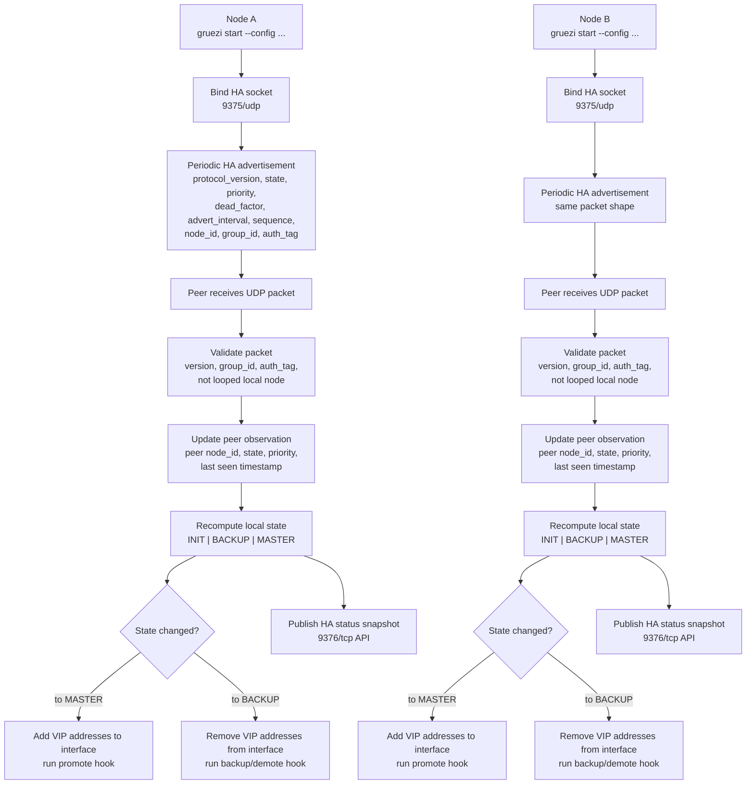

# gruezi

Service Discovery & Distributed Key-Value Store

## Roadmap

### HA

- [x] HA mode over unicast UDP at L4
- [x] IPv6-first API listener with IPv4 fallback
- [x] CLI for peer management and status
- [x] Live HA status watch mode and packet troubleshooting workflow
- [ ] DNS-based service discovery
- [x] HA packet format and authentication
- [x] HA state machine (`INIT`, `BACKUP`, `MASTER`)
- [x] HA management API on `9376/tcp`
- [x] HA transition hooks (`on_promote`, `on_demote`, `on_backup`)
- [x] HA fault hook (`on_fault`) for address-action and runtime failure paths
- [x] Graceful VIP cleanup on shutdown (`SIGINT`, `SIGTERM`)
- [x] Ansible-based HA lab deployment workflow
- [ ] Split-brain prevention and conservative failover rules
- [ ] Performance tuning for heartbeat, timers, and failover latency

### KV

- [ ] KV mode using Raft consensus
- [ ] `raft-engine` for the dedicated Raft log
- [ ] RocksDB for applied key-value state
- [ ] Snapshot creation and install flow
- [ ] Aggressive Raft log truncation after snapshot
- [ ] Snapshot lifecycle management
- [ ] Membership change and bootstrap rules
- [ ] Witness/arbiter support
- [ ] Discovery bootstrap by URL

### Operations

- [ ] Backpressure before disk exhaustion
- [ ] Quotas and reserved free space
- [ ] Clear write-stall behavior under pressure
- [ ] Security model (mTLS and auth)
- [ ] Observability (metrics and tracing)

## DRAFT: Configuration Model

Configuration should use YAML.

Default config lookup order:

* `--config /path/to/gruezi.yaml`
* `GRUEZI_CONFIG=/path/to/gruezi.yaml`
* `/etc/gruezi/gruezi.yaml`

Example configs for local testing live in:

* `examples/ha.yaml`
* `examples/kv.yaml`
* `ansible-playbook -i ansible/inventory/lab.yml ansible/deploy-ha-lab.yml` after creating local files from `ansible/inventory/lab.yml.example` and `ansible/group_vars/gruezi_ha_lab.yml.example`
* `ansible/README.md` for the HA lab deployment workflow
* `contrib/README.md` for package-oriented `.deb` and `.rpm` builds
* `CONTRIBUTING.md` for the development and pull request workflow

Draft default ports:

* `9375/udp` for `gruezi-ha`
* `9376/tcp` for `gruezi-api`
* `9377/tcp` for `gruezi-peer`

For v1, `gruezi` should expose a single top-level selector:

```yaml
mode: ha
```

or:

```yaml
mode: kv
```

Current meaning:

* `mode: ha`: keepalived-like high availability for a minimum 2-node deployment
* `mode: kv`: etcd-like distributed key-value store with quorum semantics

Deployment guidance:

* `mode: ha` for 2-node deployments
* `mode: kv` for 3+ quorum participants

In other words, when only 2 nodes are available, HA is the viable mode. Once a cluster has enough participants for Raft, consensus should become the source of truth for leadership and failover decisions.

The `mode` field is the user-facing operational choice. The underlying protocol or algorithm used to implement that mode is an internal detail.

Internally, the configuration can still be normalized into dedicated sections, but the user-facing interface should remain simple:

```yaml
mode: ha

node:
  id: node-a

ha:
  bind: 0.0.0.0:9375
  interface: eth0
  group_id: cluster-ha
  addresses:
    - 10.0.0.10/24
  peer: 10.0.0.2:7000
  protocol_version: 1
  priority: 100
  preempt: true
  advert_interval_ms: 1000
  dead_factor: 3
  hold_down_ms: 3000
  jitter_ms: 100
  auth:
    mode: none
```

```yaml
mode: kv

kv:
  role: voter
  listen_client: 0.0.0.0:9376
  listen_peer: 0.0.0.0:9377
  data_dir: /var/lib/gruezi
  initial_cluster:
    - node-a=http://10.0.0.1:2380
    - node-b=http://10.0.0.2:2380
    - witness=http://10.0.0.3:2380
```

This keeps the external configuration explicit and simple while leaving room for richer internal validation and future expansion.

## DRAFT: Protocol Direction

### HA mode

`mode: ha` should use a high-availability protocol over unicast UDP at L4.

Current implementation overview:



In practice, each node continuously:

* sends HA advertisements to exactly one configured peer over `9375/udp`
* tracks the peer's last observed state, priority, and liveness deadline
* chooses `MASTER` or `BACKUP` based on peer health, priority, node ID tiebreak, and `preempt`
* adds or removes the configured VIP addresses on state transition
* exposes the current snapshot through the management API on `9376/tcp`

Current implementation walkthrough:

1. Startup:
   the node loads the HA runtime config, binds the UDP socket on `ha.bind`, parses the single configured peer, initializes the local state as `INIT`, and publishes an initial status snapshot.
2. Advertisement loop:
   each iteration recomputes local state, waits until the next advertisement deadline, then either sends one HA packet to the configured peer or handles one received packet from that peer.
3. Packet validation:
   received packets are accepted only when the magic bytes, protocol version, `group_id`, and auth tag match, and when the packet is not looped back from the local node ID.
4. Peer observation:
   after a valid packet, the node stores the peer node ID, peer state, peer priority, and the timestamp of when that packet was observed.
5. State choice:
   if the peer is considered alive, the node compares peer state, peer priority, local priority, local node ID, and `preempt` to decide between `MASTER` and `BACKUP`.
   if the peer is not alive, the node promotes itself after the startup follower deadline or keeps `MASTER` if it already held it.
6. VIP handling:
   transitions to `MASTER` add the configured VIP addresses to the interface and run `on_promote`.
   transitions to `BACKUP` remove the configured VIP addresses and run either `on_backup` or `on_demote`.
7. Fault handling:
   address add/remove failures trigger `on_fault`.
   fatal runtime send/receive failures also trigger shutdown cleanup and `on_fault`.
8. Shutdown:
   on graceful shutdown, including `SIGINT` and `SIGTERM`, the node removes its configured VIP addresses before the runtime exits and publishes a final `INIT` snapshot.

The goal is to preserve the operational model of VRRP/CARP best practices while avoiding a dependency on L2 multicast, gratuitous ARP, or other mechanisms commonly blocked by cloud providers.

This means:

* leader election and liveness detection happen over UDP
* the state machine should remain close to active/backup failover behavior
* priority, advertisement interval, preemption, and authentication should be first-class concepts

Operational scope for HA mode:

* `mode: ha` is an internal infrastructure component, similar in intent to keepalived
* HA advertisements on `9375/udp` are expected to stay on a trusted private network
* the HA peer channel should not be exposed to the public Internet
* firewall rules should restrict HA traffic to the expected peer nodes

This is intentionally **VRRP/CARP-like**, not wire-compatible VRRP or CARP. The project should not claim protocol compatibility unless it implements the actual protocol semantics and packet format.

The HA advertisement format should be versioned and minimal. At a minimum, each packet should carry:

* protocol version
* node ID
* group or instance identifier
* current state
* priority
* advertisement interval
* sequence number
* authentication tag

Performance and reliability should be first-class requirements for HA mode:

* low-overhead UDP heartbeats
* deterministic state transitions
* conservative failover under packet loss or partitions
* explicit authentication on HA advertisements
* predictable recovery after peer restart or transient network loss
* first-class IPv6 support with IPv4 fallback when dual-stack binding is unavailable

HA observability should also be a first-class design goal:

* every promotion, demotion, backup transition, and VIP move should be explainable after the fact
* operators should be able to tell whether the cause was peer timeout, priority/preempt logic, node ID tiebreak, shutdown cleanup, or an explicit fault path
* `gruezi status`, logs, hooks, and future metrics should make the decision path visible instead of only showing the final state
* debugging HA should answer "why did this node take or drop the VIP?" without requiring packet capture as the primary source of truth

### KV mode

`mode: kv` should use Raft for consensus.

The KV subsystem is intended to provide etcd-like semantics:

* quorum-based writes
* leader election through Raft
* replicated log and durable state
* membership-aware cluster status

Operationally, `mode: kv` requires at least 3 quorum participants, or 2 nodes plus a witness/arbiter.

### API and management port

`9376/tcp` should be the common API and management port.

That means:

* in `mode: kv`, it is the client-facing API port
* in `mode: ha`, it is the live management/status port
* CLI commands such as `gruezi status` already target this API instead of talking directly to the HA or Raft peer ports

The port split should remain:

* `9375/udp`: HA peer advertisements
* `9376/tcp`: API, management, and client access
* `9377/tcp`: KV peer and Raft traffic

### Separation of concerns

HA and KV solve different problems and should remain conceptually separate:

* HA decides which node should be active in a 2-node deployment
* KV uses Raft to decide leadership and maintain authoritative replicated state in a 3+ participant deployment

For v1, the user-facing configuration should stay explicit and simple with `mode: ha` or `mode: kv`. For 2 nodes, use HA. For 3 or more quorum participants, KV is the preferred mode because Raft already provides leadership and failover behavior through consensus.

## DRAFT: KV Validation Strategy

`mode: kv` should be validated with [Maelstrom](https://github.com/jepsen-io/maelstrom), the Jepsen-based distributed systems workbench used by the Fly.io distributed systems challenges.

This is useful because Maelstrom provides:

* a simulated network with latency, loss, and partitions
* workload-specific correctness checks
* visualization and history analysis for distributed failures

The Fly.io challenges should be treated as a staged validation path for KV work, not as a literal promise to implement every challenge unchanged.

Initial KV validation milestones:

* basic RPC/message handling
* node identity and request correlation
* inter-node message propagation
* replicated log behavior
* Raft leader election and quorum behavior

As `mode: kv` evolves, tests should move from local unit coverage to Maelstrom-driven fault-injection and correctness checks.

## DRAFT: Storage Direction

For `mode: kv`, storage should be split by workload:

* `raft-engine` as the dedicated Raft log engine for the consensus journal
* RocksDB for the applied key-value state
* snapshots managed separately from the live Raft log and KV state

The Raft log and the applied KV state are different things:

* the Raft log stores ordered replicated commands
* the KV state stores the result after committed commands are applied

This separation should make it easier to optimize for performance and resilience under disk pressure.

The intended operational goals are:

* fast sequential Raft appends and replay
* efficient log truncation after snapshotting
* durable and performant KV reads/writes through RocksDB
* better disk-pressure handling than a single shared backend

For v1, `gruezi` should use a single Raft group. `raft-engine` is still the preferred direction for the Raft log even though it is designed to support Multi-Raft, because the log engine characteristics are a better fit for consensus journals than a general-purpose KV backend.

To support that, the system should explicitly implement:

* aggressive Raft log truncation after snapshot
* snapshot lifecycle management
* backpressure before disk exhaustion
* quotas and reserved free space
* clear write-stall behavior under pressure

## DRAFT: Snapshot Model

Snapshots are required to keep the Raft log from growing without bound.

The expected model is:

* committed log entries are applied to RocksDB
* a snapshot captures the applied KV state at a specific Raft index and term
* once the snapshot is durable, older Raft log segments can be truncated

Each snapshot should include:

* last included Raft index
* last included Raft term
* cluster membership metadata
* snapshot format version
* checksum

Snapshots should be used for:

* faster node restart and recovery
* catching up lagging or newly joined followers
* bounding disk usage for the Raft log

Snapshot lifecycle should define:

* when snapshots are triggered
* how snapshots are transferred to other nodes
* when old snapshots can be deleted
* when Raft log truncation is allowed after snapshot persistence

## DRAFT: On-Disk Layout

`mode: kv` should separate persistent data by purpose:

* `raft/` for the Raft log engine
* `kv/` for RocksDB applied state
* `snapshots/` for snapshot files and metadata

This layout should allow independent quotas, cleanup policies, and recovery behavior.

## DRAFT: Membership And Bootstrap

Cluster lifecycle needs explicit rules.

Items that must be defined:

* first cluster bootstrap
* adding a new node
* replacing a failed node
* removing a node safely
* restart behavior after crash or partial disk loss
* witness or arbiter behavior, if supported

For v1, membership changes should be conservative and explicit. Unsafe ad-hoc joins should be avoided.

## DRAFT: Failure And Disk-Pressure Behavior

Disk pressure should be treated as a first-class failure mode.

Behavior to define:

* reserved free-space threshold
* warning threshold and critical threshold
* when writes are throttled
* when writes are rejected
* when compaction, truncation, or snapshot cleanup is triggered
* when the node reports degraded or read-only state

The goal is to fail predictably before the disk is fully exhausted.

## DRAFT: HA Failure Semantics

For `mode: ha`, split-brain prevention must be documented explicitly.

Items to define:

* promotion rules
* preemption rules
* peer loss timeout
* behavior under network partition
* fencing or external safety checks, if required

For a 2-node deployment, HA should prefer deterministic and conservative failover behavior over aggressive promotion.

## DRAFT: HA Implementation Priorities

The HA path should be built first as the smallest end-to-end feature.

Suggested order:

* YAML config schema and validation for `mode: ha`
* node identity, peer identity, and interface/address configuration
* UDP packet format with versioning and authentication fields
* heartbeat sender/receiver loop with bounded timers
* HA state machine with `INIT`, `BACKUP`, and `MASTER`
* promotion, preemption, and failover rules
* CLI status output and metrics

HA v1 should optimize for:

* strong reliability before fast failover
* bounded CPU and memory overhead
* clear behavior during packet loss, delay, or temporary partitions
* simple and observable state transitions for debugging

Recommended HA timer defaults:

* `advert_interval_ms: 1000`
* `dead_factor: 3`
* `hold_down_ms: 3000`
* `jitter_ms: 100`

Recommended HA auth shape:

```yaml
ha:
  group_id: cluster-ha
  auth:
    mode: shared_key
    key: change-me
```

Meaning of the HA fields:

* `group_id`: logical HA domain. Only nodes in the same group should accept each other's advertisements.
* `auth.mode: none`: disable packet authentication. This is only suitable for local development or isolated lab testing.
* `auth.mode: shared_key`: every HA packet carries an authentication tag derived from a shared secret and the packet contents.
* `auth.key`: the shared secret used by all nodes in the same HA group. It should be treated like any other cluster secret and distributed securely.

`shared_key` in HA mode is not transport encryption. It exists to answer a narrower question:

* is this UDP advertisement from a node that knows the group secret?
* was the packet likely modified in transit?

This is a better fit for HA v1 because the HA control plane is unicast UDP. `mTLS` is a strong option for TCP-based APIs and Raft peer links, but it does not apply directly to raw UDP advertisements. The comparable UDP-level option would be `DTLS` or a more advanced per-packet cryptographic scheme, which adds more complexity than is needed for the initial HA protocol.

Recommended direction:

* HA over UDP: start with explicit packet authentication using `shared_key`
* API and KV peer traffic over TCP: use TLS/mTLS
* future HA hardening: consider DTLS or stronger keyed message authentication if the simpler HA packet auth is not sufficient

Threat-model note:

* `shared_key` is a practical first step for a private HA network, not a full Internet-facing security model
* it should be combined with network isolation, peer allow-listing, and standard infrastructure firewalling
* if HA traffic ever needs to cross less-trusted networks, the design should be revisited with stronger transport or packet-level protections

Operational guidance:

* use `auth.mode: none` only for tests and local experiments
* use a different `auth.key` per HA group/environment
* rotate the key carefully, because all HA peers in the same group must agree on it
* do not treat `shared_key` as a substitute for TLS on the management API

### Current HA API

The current HA management API is read-only and listens on `9376/tcp`.

Available endpoints:

* `GET /status`
* `GET /ha/status`
* `GET /healthz`

The current `gruezi status` command queries this API.

For a live view during failover testing:

```bash
gruezi status --watch --interval-ms 1000 --node 192.0.2.5:9376
```

### HA Packet Troubleshooting

For HA packet troubleshooting, use `gruezi status --watch` and `tcpdump` together:

```bash
gruezi status --watch --interval-ms 1000 --node 192.0.2.10:9376
```

```bash
sudo tcpdump -ni eth0 'udp port 9375 and host 192.0.2.11' -tttt -vvv -X -s0
```

Recommended `tcpdump` flags:

* `-n`: disable DNS lookups
* `-tttt`: print readable timestamps for correlation with `status --watch`
* `-vvv`: increase protocol detail
* `-X`: show packet payload in hex and ASCII
* `-s0`: capture the full packet instead of truncating it

This lets you correlate:

* `sent` and `recv` counters from `gruezi status --watch`
* peer liveness and `last_peer_seen`
* raw UDP payload bytes on `9375/udp`

### Current HA Hooks

The current HA implementation supports transition hooks in YAML:

```yaml
ha:
  hooks:
    on_promote: /etc/gruezi/hooks/promote.sh
    on_demote: /etc/gruezi/hooks/demote.sh
    on_backup: /etc/gruezi/hooks/backup.sh
    on_fault: /etc/gruezi/hooks/fault.sh
    timeout_ms: 5000
```

Implemented today:

* `on_promote`
* `on_demote`
* `on_backup`
* `on_fault` for explicit HA address-action and runtime failure paths

Hook scripts currently receive runtime context through environment variables:

* `GRUEZI_EVENT`
* `GRUEZI_NODE_ID`
* `GRUEZI_GROUP_ID`
* `GRUEZI_INTERFACE`
* `GRUEZI_STATE`
* `GRUEZI_PREVIOUS_STATE`
* `GRUEZI_PEER_ID`
* `GRUEZI_PEER_STATE`

## DRAFT: API And Service Discovery

The external API surface for `mode: kv` still needs to be defined.

Questions to settle:

* etcd-compatible API or custom API
* gRPC, HTTP, or both
* key-space layout and prefix conventions
* watch/stream semantics
* lease/session behavior

API listeners must not be IPv4-only by default. The preferred behavior is:

* explicit `listen` IP binds exactly that IP family
* if no listen IP is provided, try dual-stack IPv6 first
* if dual-stack IPv6 is unavailable, fall back to IPv4

If an HTTP API is added, `axum` is a reasonable choice on top of a pre-bound `TcpListener`.

Service discovery also needs clear rules:

* how records are stored in KV
* how DNS responses are generated
* TTL and expiration behavior
* health integration and stale record cleanup

## DRAFT: Security And Observability

Both modes should plan for production-grade safety and debugging.

Minimum areas to define:

* mTLS between nodes
* client authentication and authorization
* certificate rotation
* metrics for leadership, replication lag, snapshot size, disk usage, and write stalls
* tracing for elections, failover, and storage operations
